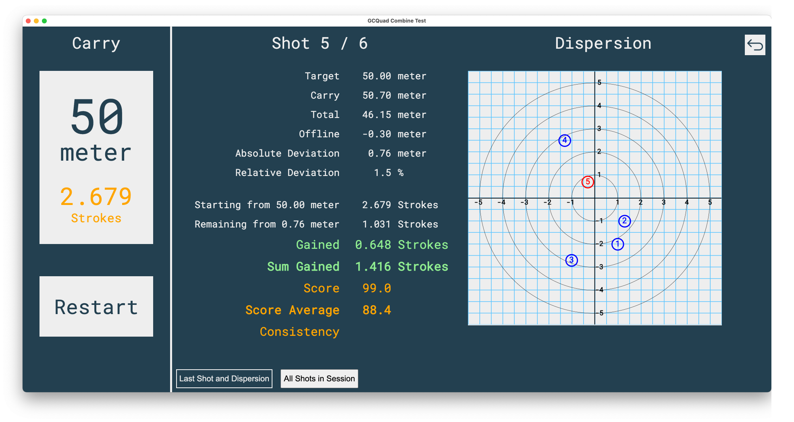
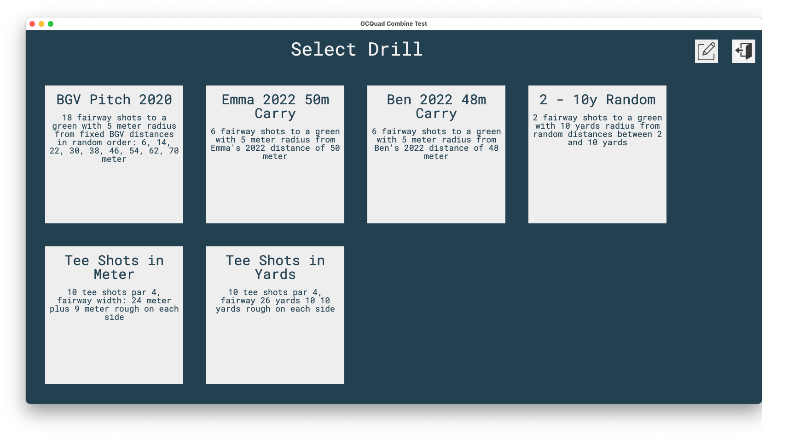
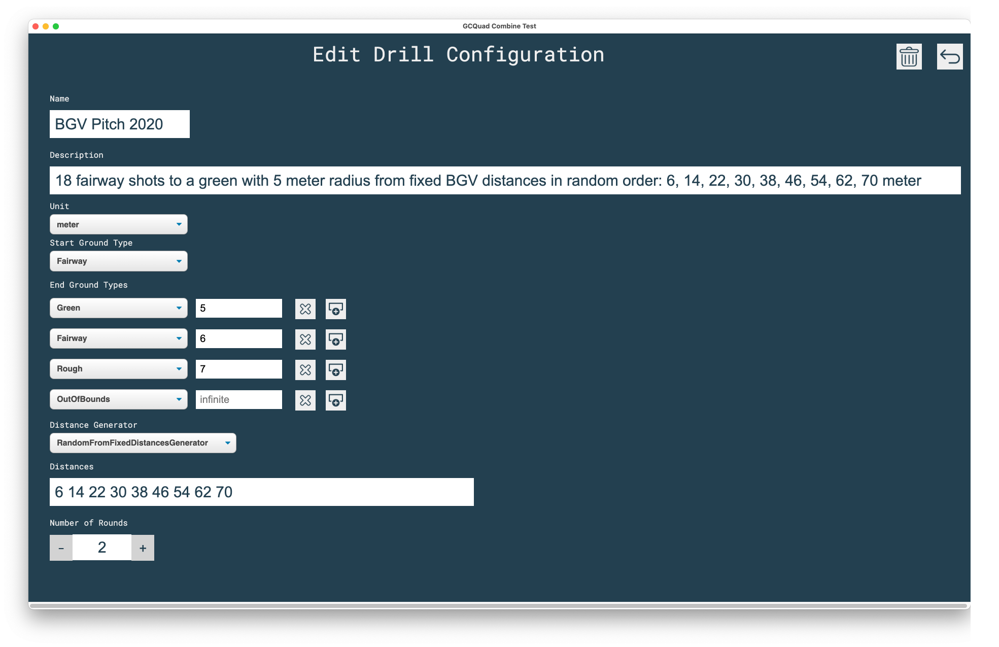
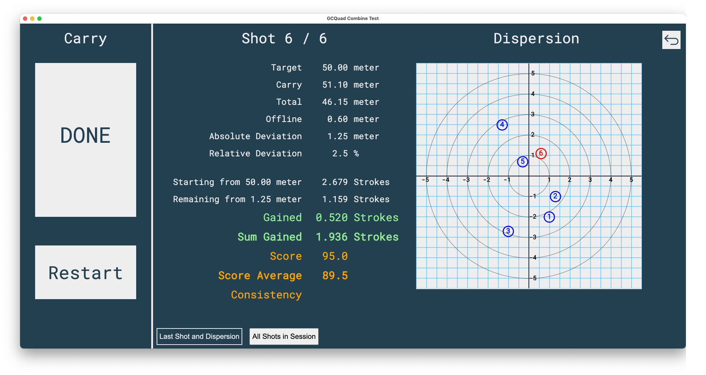
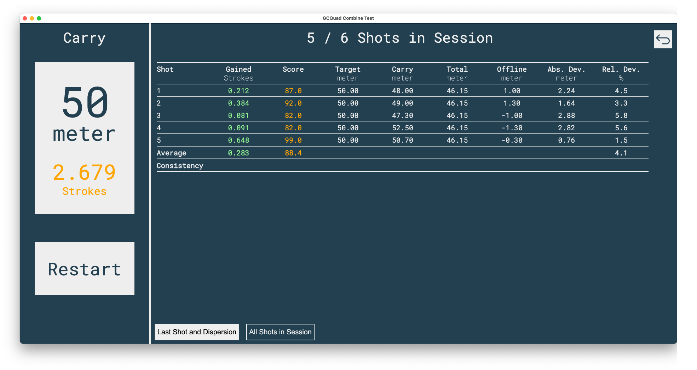

# GCQuad Combine Test

The idea comes from the Trackman Combine test. The quality of your shots is rated using the shots gained approach.

All you need is QCQuad, GC3 or QC2 connected to FSX2020 and the "GCQuad Combine Test" program installed on your
computer.

In FSX2020 you have to start the Practice Range and enable "Write Shots CSV" in the Settings:
[FSX2020 User Manual - General Settings](https://www.foresightsports.com/fsx-2020-user-manual#:~:text=Write%20Shots%20CSV%3A%20When%20enabled,game%20to%20assist%20with%20aim)

Every last shot data is now automatically exported to folder C:/Program Files (x86)/Foresight Sports
Experience/System/LastShot.CSV

The "GCQuad Combine Test" program reads this file and displays some shot data together with the points you get from the
shots gained rating and the Trackman score.

If you have a 2 or more monitor setup (beamer + monitor or beamer + laptop display) you can run FSX2020 on the beamer to
see the range and the ball flights and run the QCQuadCombineTest on the other monitor to see the ball/club data, shots
gained and Trackman score.

## Install

Create from source (see below) or just download and install
the [Latest Release](https://github.com/christianrehn/GCQuadCombineTest/releases/latest/download/GCQuadCombineTest-1.2.2.Setup.exe)
. When you see the "Windows protected your PC" message click on "More info" and "Run anyway" because I did not pay
Microsoft for a code validation certificate.

## Usage

Select one of the predefined drill configurations:

Or add a new drill configurations or edit existing ones:

Execute the shots and see the dispersion and Shots Gained and Trackman Scores for the last stroke:

Or for all shots in current session (without dispersion):

## Inaccuracies

* I do not have shots gained values for carry distances so the shots gained for total distances are used to compute
  shots gained for carry distances.
* I do not have the formulas to calculate the Trackman scores but approximations so there might be a small delta
  compared to the original Trackman score calculation. But all Trackman scores that I have to develop and test my
  calculation (more than 300 shots)  are identical.
* I think (I am not sure) the offline value in LastShot.CSV is the total offline, not the carry offline that I would
  need to calculate shots gained rating and the Trackman score. But currently it is the best approximation I currently
  have.

## Please Support me

Please support me by sharing your Trackman scores with me (if possible in Excel format). The more data I have the better
my score calcualtion gets. To share it create a branch in GitHub or mail it to golf.logbook@gmail.com.

If you have a good ball flight model implementation and you are willing to share it with me I would like to directly
connect my QCQuad with this App. I have already analyzed the QCQuad network traffic to get all the data QCQuad provides.
But values like carry/total distance or offline have to be calculated by a ball flight model (that is currently the task
of the FSX2020 software).

## Maybe you want to track your training data

Check out my 100% free iOS App: [Golf Logbook](https://christianrehn.github.io/golf-logbook/)

## Ideas for the next versions:

* Show additional club/ball data so you do not have to switch to FSX2020 to see them.
* Calculate consistency for different values like score, dynamic loft, ... (Gaussian standard deviation).
* Save shot history.
* Add rating that is similar to Trackman Combine Test for Drives.
* Show overview/report like Trackman "Test Center or Combine report". Create links to share reports.
* Improve splash screen.

* Installer looks ugly -> change
* Shots gained rating for tee shots with the driver
* Select between Total and Carry (currently only carry is used)
* Enter directory to watch for LastShot.CSV

# For Developers

## Technical Details

This program has been built using Electron, React and Typescript. You can define new Tests (distances, green size, yards
or meter, ...) in file src/data/TestsConfiguration.json

After cloning the repo you can:

* start the program from source: yarn start
* build a new executable version (using both maker-squirrel (my preferred installer) and maker-wix on a MS Windows
  system):
    * update version number in package.json
    * yarn clean && yarn install && yarn make
* check for outdated packages: yarn outdated
* upgrade packages: yarn upgrade

## To Fix

* "Warning: A component is changing an uncontrolled input to be controlled." when entering a number for radius in end
  ground types table.
* Change to edit configuration takes very long under Windows (not under mac os)
