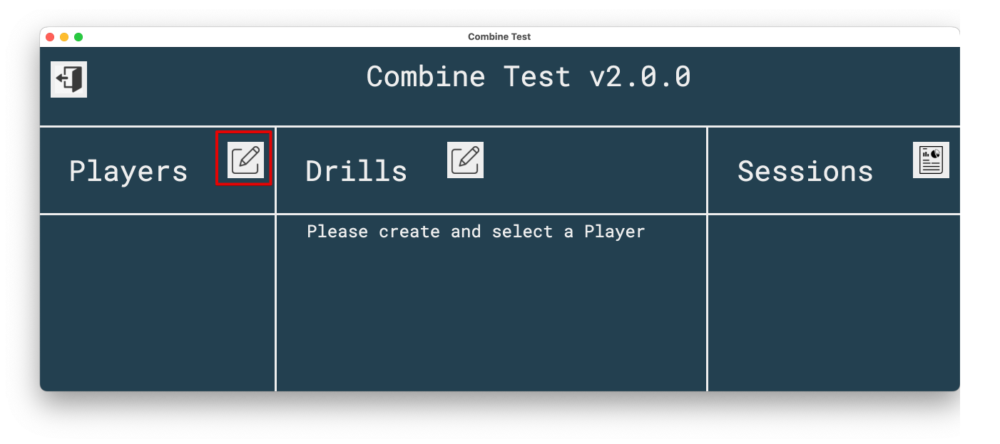
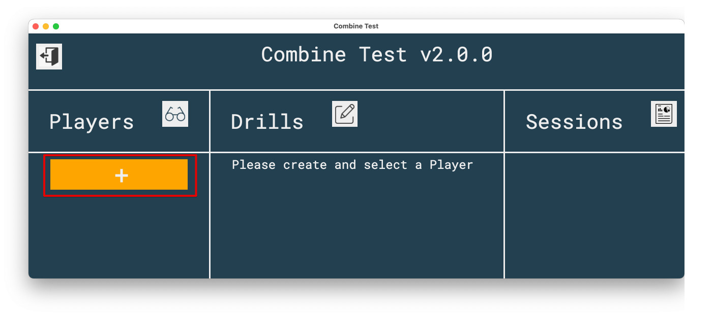
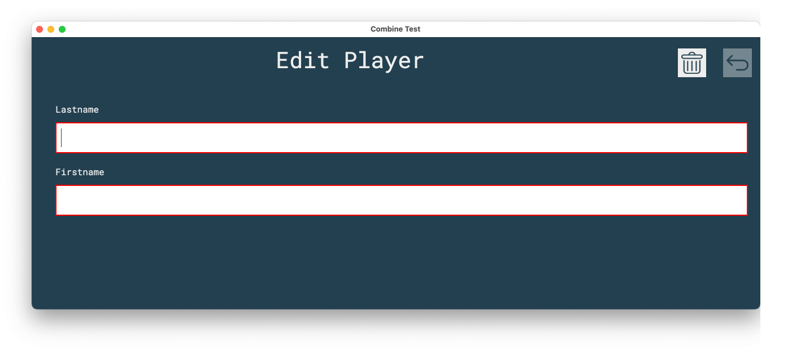
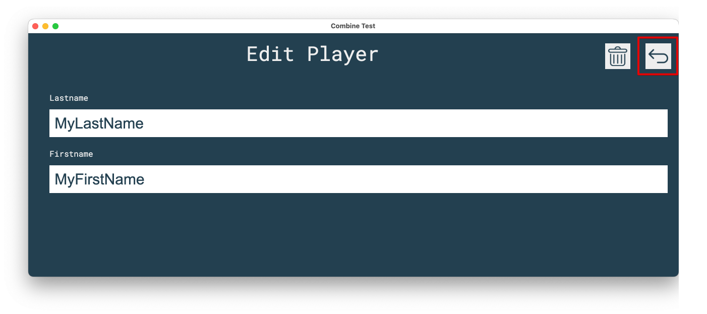
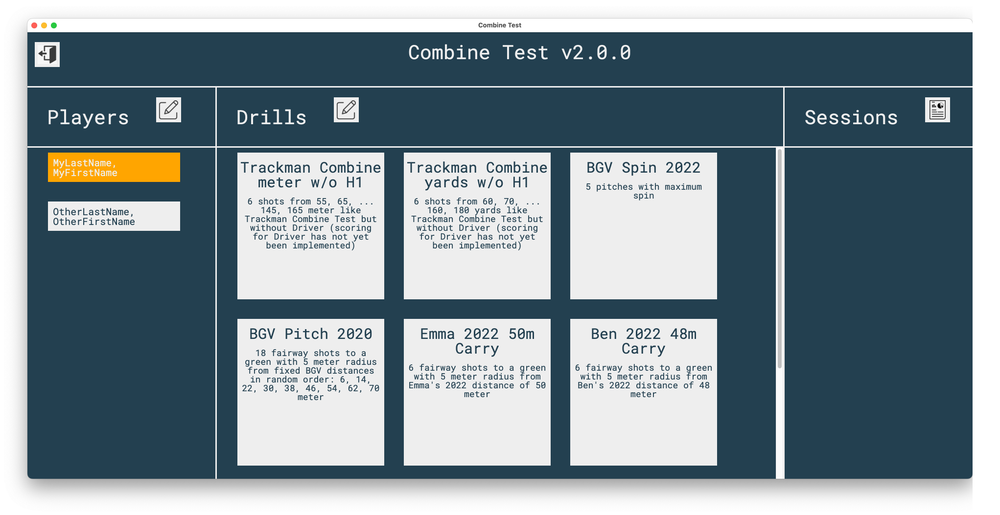
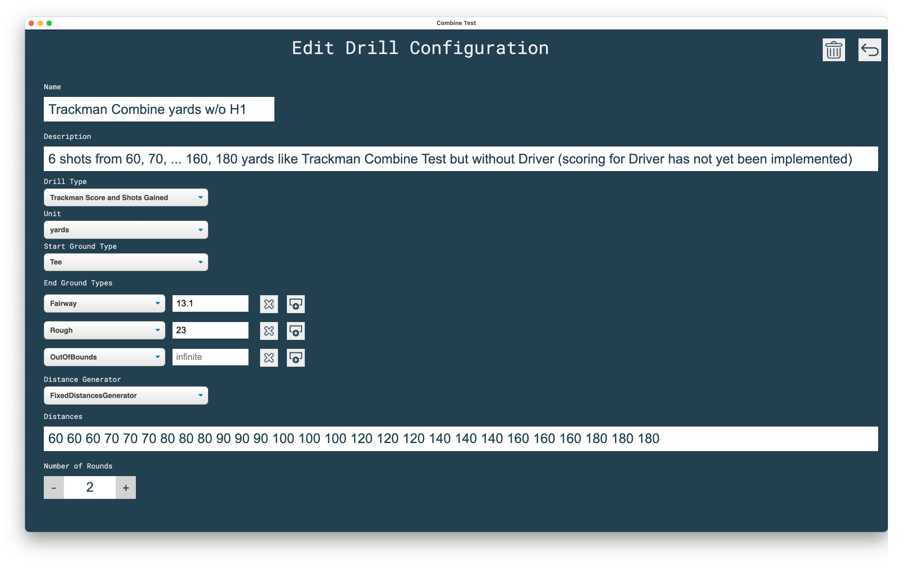

## Background

The idea comes from
the [Trackman Combine test](https://www.dennissalesgolf.com/golf-drills-and-practice-blogs/2016/3/6/trackman-combine-test-benchmark-your-game)
. The quality of each of your shots is rated with a score between 0 and 100. Because I do not own a Trackman but a
[GCQuad](https://www.foresightsports.com/gcquad-quadrascopic-launch-monitor)
from [Foresight Sports](https://www.foresightsports.com) I decided to implement my own "Combine Test" program that
delivers (nearly)
the same score numbers as the original Trackman Combine. As the algorithms to calculate combine scores are not public I
collected as much Trackman data as I could find and analysed the combine score calculation with Excel. The results of
this analysis are the parameters for the linear functions of the score calculation in my program that.

In addition my "Combine Test" program also rates each shot using
the [shots gained approach](https://www.pgatour.com/news/2016/05/31/strokes-gained-defined.html) which is explained in
detail in [Mark Broadie's Book Every Shot Counts](https://www.amazon.com/-/es/Mark-Broadie/dp/1592407501).

## Prerequisites to run my "Combine Test"

All you need is [QCQuad](https://www.foresightsports.com/gcquad-quadrascopic-launch-monitor)
, [GC3](https://www.foresightsports.com/gc3),
[QC2](https://shop.foresightsports.com/collections/certified-pre-owned-gc-launch-monitors/products/cpo-gc2)
or [GCHawk](https://www.foresightsports.com/gchawk) connected to [FSX2020](https://www.foresightsports.com/fsx2020) and
my 100% free and open source "Combine Test"
program installed on your computer (my software could be easily modified to support other launch monitors, it just needs
some ball and club data like carry distance or offline per shot in a CSV file or I could also provide an additional
technical interface).

In [FSX2020](https://www.foresightsports.com/fsx2020) you have to start the Practice Range and enable "Write Shots CSV"
in the
Settings: [FSX2020 User Manual - General Settings](https://www.foresightsports.com/fsx-2020-user-manual#:~:text=Write%20Shots%20CSV%3A%20When%20enabled,game%20to%20assist%20with%20aim)

Every last shot data is now automatically exported to folder
"C:/Program Files (x86)/Foresight Sports Experience/System/LastShot.CSV"

The "Combine Test" program reads this file and displays some shot data together with the points you get from the shots
gained rating and the Trackman score.

If you have a 2 or more monitor setup (beamer + monitor or beamer + laptop display) you can run FSX2020 on the beamer to
see the range and the ball flights and run the QCQuadCombineTest on the other monitor to see the ball/club data, shots
gained and Trackman score.

## Install

Create from source (see below) or just download and install
the [Latest Release](https://github.com/christianrehn/CombineTest/releases) named CombineTest-X.Y.Z.Setup.exe where
X.Y.Z is the release number. As of version 1.2.6 self-update functionallity has been implemented. Updates are
automatically downloaded and installed on the next start of the application.

When you see the "Windows protected your PC" message click on "More info" and "Run anyway" because I did not pay
Microsoft for a code validation certificate.

## Usage

Create a new Player:

Select one of the players:

Select one of the predefined drill configurations:

Or add a new drill configurations or edit existing ones:

Execute the shots and see the dispersion and Shots Gained and Trackman Scores for the last stroke:

Or for all shots in current session (without dispersion):

### Drill Type

Starting from version 2.0 you can select between different drill types:

#### Trackman Combine and Shots gained

This drill type is what you already know from the Trackman Combine Test.
You have a target and try to shoot as near as possible to the target.
The lower the distance to the target the higher the score.

#### Spin

The Spin type is completely different.
As you can already guess from the name you have to produce a lot of spin to get a high score.
Each spin drill defines a landing area in percent or meter/yard.
If your ball lands outside this corridor you get a zero score.
If your ball is inside this corridor you get a score that depends on the total spin you created with your shot.
The drill configuration defines the spin per meter/yard that you have to create in order to get a score of 100.
If you create more or less spin you get a higher or lower score.
The score is linearly dependent on the generated spin.
So if you only create half of the predefined target spin per meter/yard you only get a score of 50.
If you create two times the predefined target spin per meter/yard you get a score of 200.

#### Hitting Circle

Will be available from version 2.1

## Track your golf training data

Maybe you also want to check out my 100% free iOS App: [Golf Logbook](https://christianrehn.github.io/golf-logbook/)

## Known inaccuracies

* I do not have shots gained values for carry distances so the shots gained for total distances are used to compute
  shots gained for carry distances.
* I do not have the formulas to calculate the Trackman scores but approximations so there might be a small delta
  compared to the original Trackman score calculation. But all Trackman scores that I have to develop and test my
  calculation (more than 300 shots)  are identical.
* I think (I am not sure) the offline value in LastShot.CSV is the total offline, not the carry offline that I would
  need to calculate shots gained rating and the Trackman score. But currently it is the best approximation I
  have.

## Please support me

### With your data

Please support me by sharing your Trackman scores with me (if possible in Excel format). The more data I have the better
my score calcualtion gets. To share it create a branch in this GitHub repo or mail it to golf.logbook@gmail.com.

### With a ball flight model

If you have a good ball flight model implementation and you are willing to share it with me I would like to directly
connect my QCQuad/GC3/GC2 with this App. I have already analyzed the QCQuad network traffic to get all the data QCQuad
provides. But values like carry/total distances or offline have to be calculated by a ball flight model (which is
currently the task of the FSX2020 software).

## Ideas for the next versions

* Show version number in app.
* Show additional club/ball data so you do not have to switch to FSX2020 to see them.
* Show overview/report like Trackman "Test Center or Combine report". Create links to share reports.
* Add rating that is similar to Trackman Combine Test for Drives.
* Shots gained rating for tee shots with the driver

* Improve splash screen.
* Installer looks ugly -> change
* Select between Total and Carry (currently only carry is used)
* Enter directory to watch for LastShot.CSV

## For Developers

### Technical Details

This program has been built using Node v14, Electron v6, React v17 and Typescript v4. You can define new Tests (
distances, green size, yards or meter, ...) in file src/data/TestsConfiguration.json

After cloning the repo you can:

* start the program from source: yarn start
* build a new executable version using maker-squirrel on a MS Windows system:
    * update version number in package.json
    * yarn clean && yarn ci && yarn make
    * in order to yarn electron-forge publish to the github repo the environment variable GITHUB_TOKEN has to be set
      because it is used in forge.config.js
    * add new versions for auto-update to updates.json file
* check for outdated packages: yarn outdated
* upgrade packages: yarn upgrade
* to see console logs of main in production add --enable-logging command line option

### To Fix

* "Warning: A component is changing an uncontrolled input to be controlled." when entering a number for radius in end
  ground types table.
* Change to edit configuration takes very long under Windows (not under mac os)
